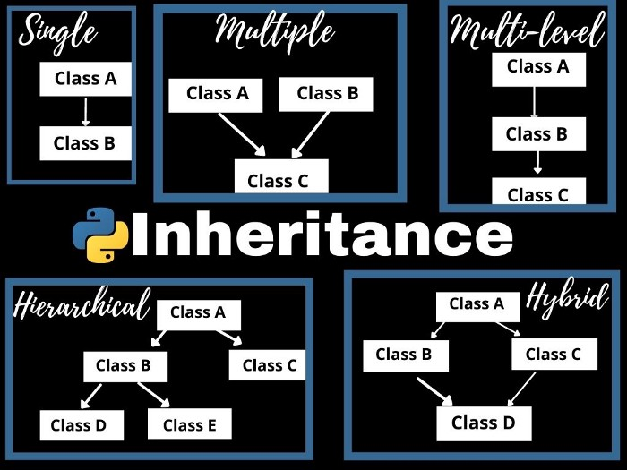

## Course about concspts OOP in Python 

Tasks which train OOP - Python object oriented programming


Object-oriented programming (OOP) is a method of structuring a program by bundling related properties and behaviors into individual objects. In this tutorial, you’ll learn the basics of object-oriented programming in Python.  

Conceptually, objects are like the components of a system. Think of a program as a factory assembly line of sorts. At each step of the assembly line a system component processes some material, ultimately transforming raw material into a finished product.  

Main Concepts of Object-Oriented Programming (OOPs) 

    Class
    Objects
    Polymorphism
    Encapsulation
    Inheritance
    Data Abstraction


### 1. Class 

A class is a collection of objects. A class contains the blueprints or the prototype from which the objects are being created. It is a logical entity that contains some attributes and methods. 

```
class Cat:
    pass
```


### 2. Objects

The object is an entity that has a state and behavior associated with it. It may be any real-world object like a mouse, keyboard, chair, table, pen, etc. Integers, strings, floating-point numbers, even arrays, and dictionaries, are all objects. More specifically, any single integer or any single string is an object. The number 12 is an object, the string “Hello, world” is an object, a list is an object that can hold other objects, and so on. You’ve been using objects all along and may not even realize it.

An object consists of :

    State: It is represented by the attributes of an object. It also reflects the properties of an object.
    Behavior: It is represented by the methods of an object. It also reflects the response of an object to other objects.
    Identity: It gives a unique name to an object and enables one object to interact with other objects.

### 3. Inheritance

Inheritance is the capability of one class to derive or inherit the properties from another class. The class that derives properties is called the derived class or child class and the class from which the properties are being derived is called the base class or parent class. The benefits of inheritance are:

    It represents real-world relationships well.
    It provides the reusability of a code. We don’t have to write the same code again and again. Also, it allows us to add more features to a class without modifying it.
    It is transitive in nature, which means that if class B inherits from another class A, then all the subclasses of B would automatically inherit from class A.

Types of Inheritance – 

Single Inheritance:
Single-level inheritance enables a derived class to inherit characteristics from a single-parent class.

Multilevel Inheritance:
Multi-level inheritance enables a derived class to inherit properties from an immediate parent class which in turn inherits properties from his parent class.

Hierarchical Inheritance:
Hierarchical level inheritance enables more than one derived class to inherit properties from a parent class.

Multiple Inheritance:
Multiple level inheritance enables one derived class to inherit properties from more than one base class.



```
class Animal:

    def __init__(self, name):
        self.name = name 
        print(self.name + " was adopted.")

    def run(self):
        print("running!")


class Dog(Animal):

    def __init__(self):
        super().init 

    def bark(self):
        print("woof!")


# new dog behavior inherited from Animal parent class 
spot = Dog("spot") #=> spot was adopted. 
spot.run() #=> running! 
```

### 4. Polymorphism

Polymorphism simply means having many forms. For example, we need to determine if the given species of birds fly or not, using polymorphism we can do this using a single function.  


```
class Animal:

    def __init__(self, name):
        self.name = name 
        print(self.name + " was adopted.")

    def run(self):
        print("running!")


class Turtle(Animal):

    def __init__(self):
        super().init 

    def run(self):
        print("running slowly!")


# we get back an interesting response 
tim = Turtle("tim") #=> tim was adopted. 
tim.run() #=> running slowly!
```

or

Operator + for types int and string

```
# Polymorphism example in python
# Addition using '+' operator
var1 = 1
var2 = 2
print("Addition of number :",var1+var2)
# Concatenation of string using '+' operator
str1 = 'Hello'
str2 = ' World'
print("Concatenation of string :", str1 + str2)
```
Output:
```
>>> Addition of number : 3

>>> Concatenation of string : Hello World
```

### 5. Encapsulation

Encapsulation is one of the fundamental concepts in object-oriented programming (OOP). It describes the idea of wrapping data and the methods that work on data within one unit. This puts restrictions on accessing variables and methods directly and can prevent the accidental modification of data. To prevent accidental change, an object’s variable can only be changed by an object’s method. Those types of variables are known as private variables.


A class is an example of encapsulation as it encapsulates all the data that is member functions, variables, etc.  

Encapsulation is the method of keeping all the state, variables, and methods private unless declared to be public.

```
class Fish:

    def __init__(self):
        self.__size = "big"

    def get_size(self):
        print("I'm a " + self.__size + " fish")

    def set_size(self, new_size):
        self.__size = new_size 

# using the getter method
oscar = Fish()
oscar.get_size()  #=> I'm a big fish

# change the size 
bert = Fish()
bert.__size = "small" 
bert.get_size() #=> I'm a big fish

# using setter method
fin = Fish()
fin.set_size("tiny")
fin.get_size() #=> I'm a tiny fish
```

### 6. Data Abstraction 

It hides the unnecessary code details from the user. Also,  when we do not want to give out sensitive parts of our code implementation and this is where data abstraction came.


Data Abstraction in Python can be achieved through creating abstract classes.